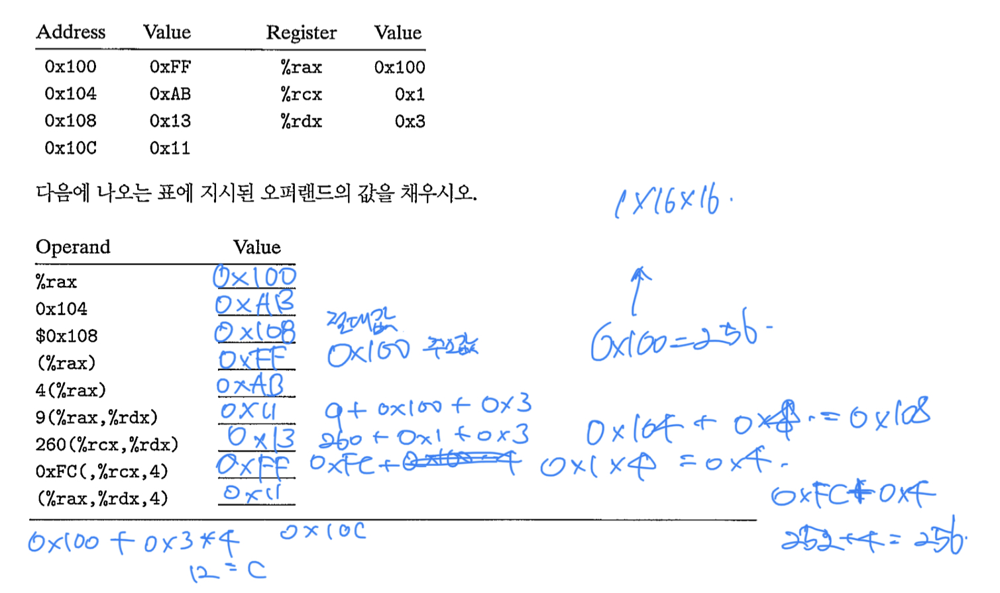
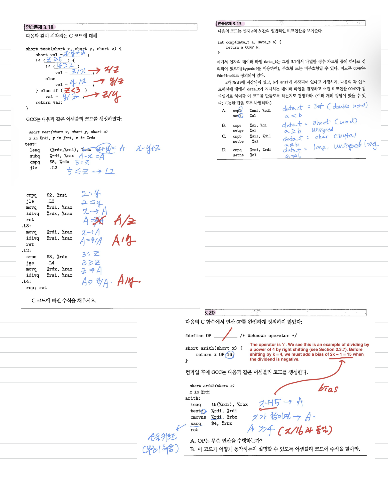
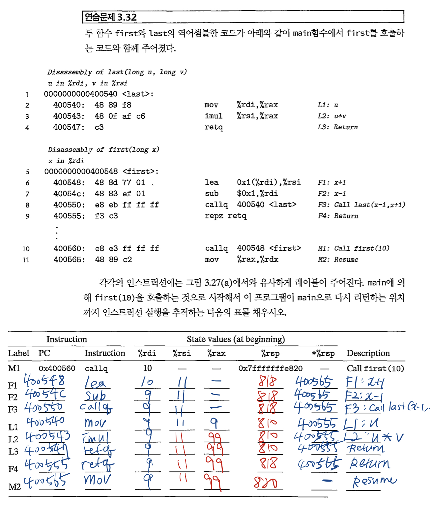
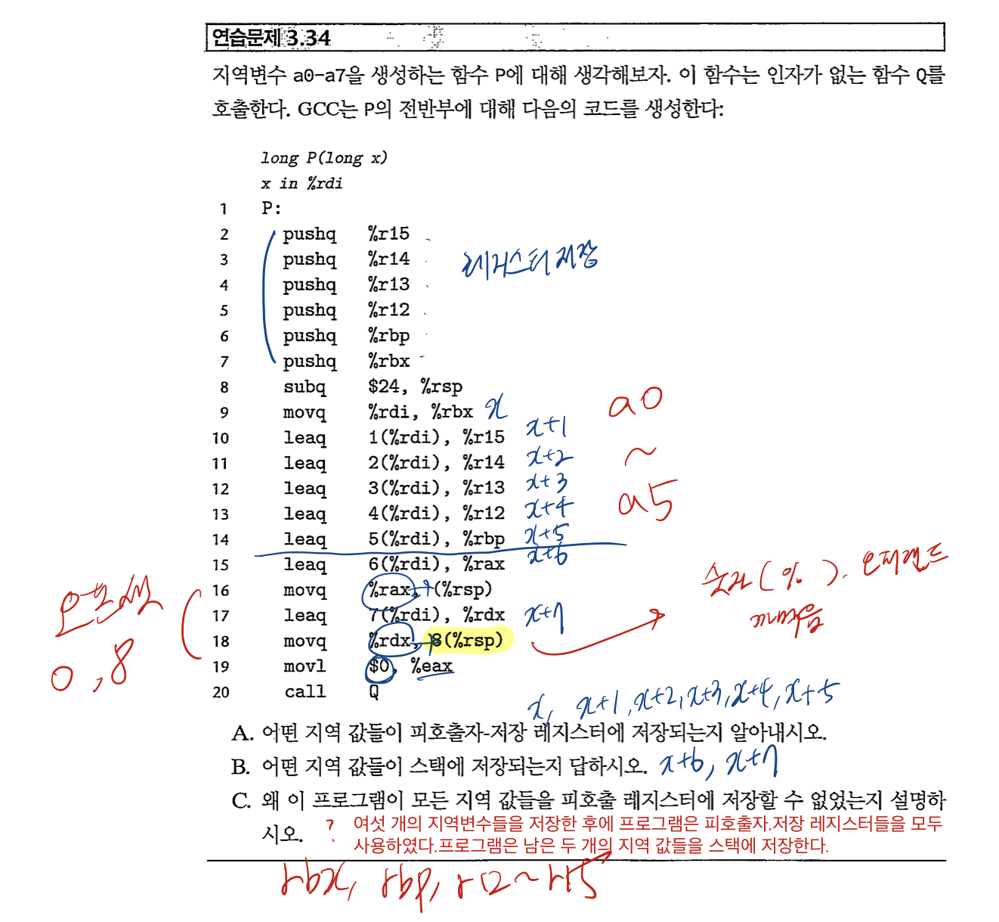
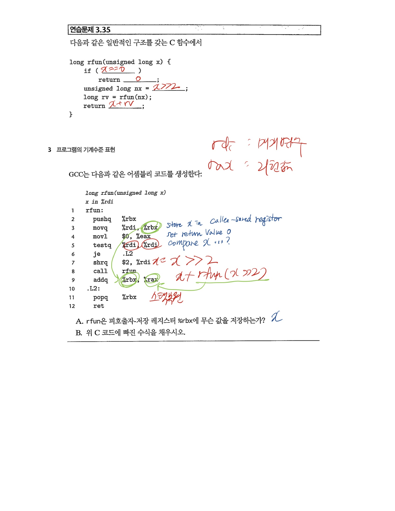
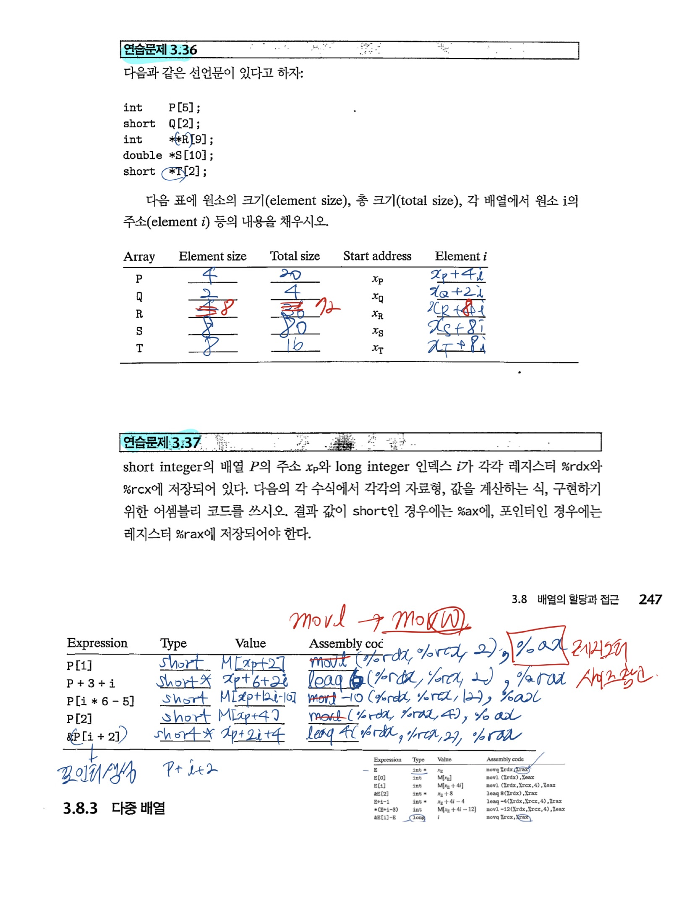
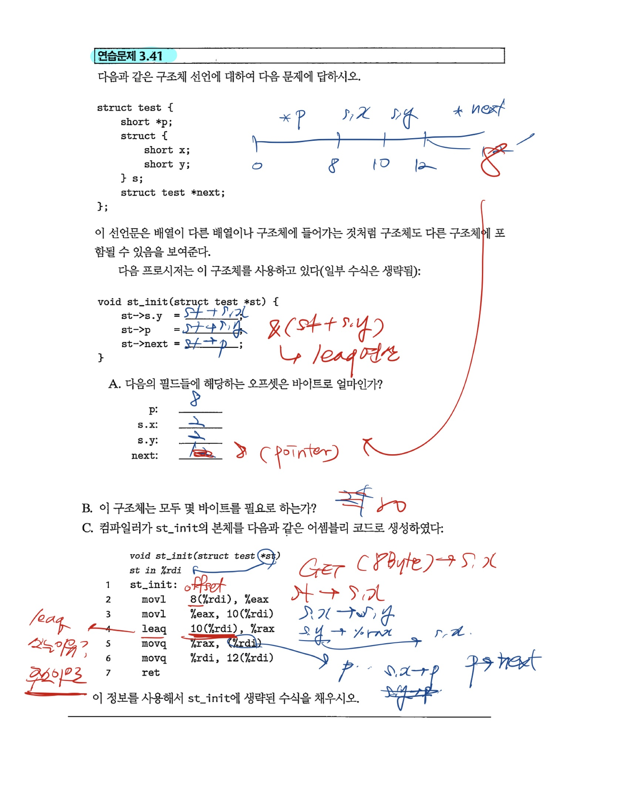
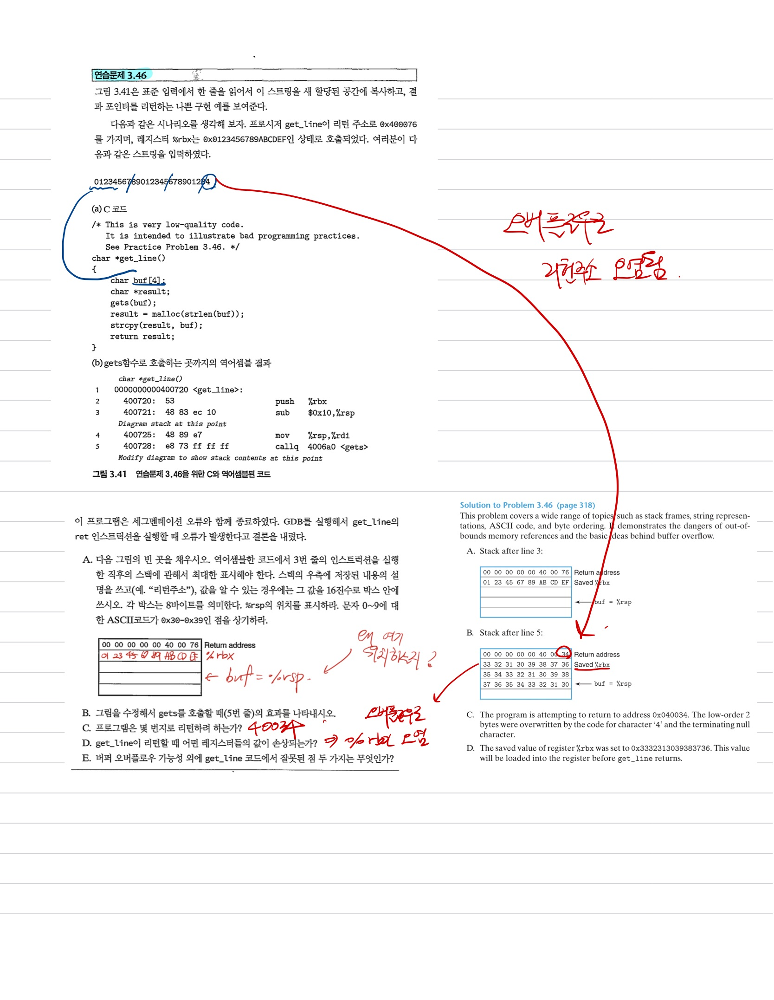
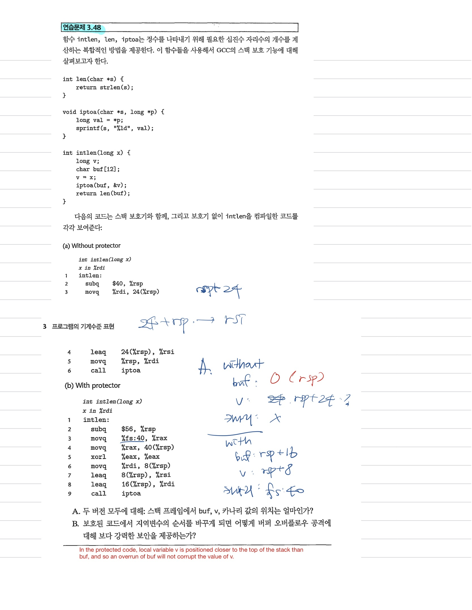

# Ch 3 Problem Solving

## 어셈블리 오퍼랜드

### 3.1

### 3.2

### 3.3

## 조건문, 반복문

### 3.13, 3.18, 3.20

## 프로시저

### 3.32

### 3.34

### 3.35

## 배열, 구조체

### 3.36, 3.37

### 3.38

### 3.41

## 심화

### 3.46

### 3.47

### 3.48

