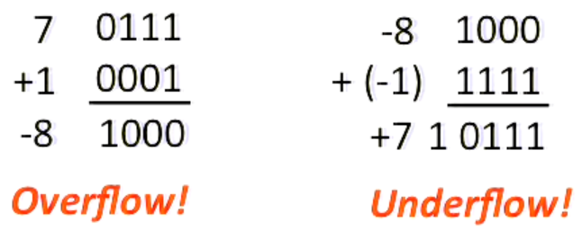

# L01 Course Introduction

[https://www.youtube.com/watch?v=9y_sUqHeyy8](https://www.youtube.com/watch?v=9y_sUqHeyy8)

# Great ideas in computer architecture

## Abstraction

Hiding unnecessary details from upper level

## Moore’s Law

The number of transistors in a dense integrated circuit (IC) doubles about every 18 months.

## Principle of locality

An object is influenced directly only by its immediate surroundings.

## Parallelism

Doing multiple things at once.

Amdahl’s Law: Performance will not rise in the same proportion asthe incrrease in CPU cores.

## Performance measurement & improvement

Tuning application to underlying hardware to exploit locality, parallelism.

## Dependability via redundancy

Redundancy so that a failng piece doesn’t make the whole system fail.

Redundant datacenters, disks, memory bits.

# Everything is a number

- Inside computers, everything is a number.
- Numbers are usually stored with a fixed size. (8bit bytes, 16bit half words, 32bit words, 64bit double words, …)
- Integer and floating-point operations can lead to results too big to store within their representations: *overflow* / *underflow*
- Binary, hexadecimal, decimal.. → different ways to represent an integer

### How to make complements and how *plus* operation works

- Invert all bits and add 1
- ex) 3 → 0011 → (invert) 1100 → (add 1) 1101 → -3
- 3 + (-2) = 0011 + 1110 = (1) 0001 → 1
- overflow, underflow
    
    
